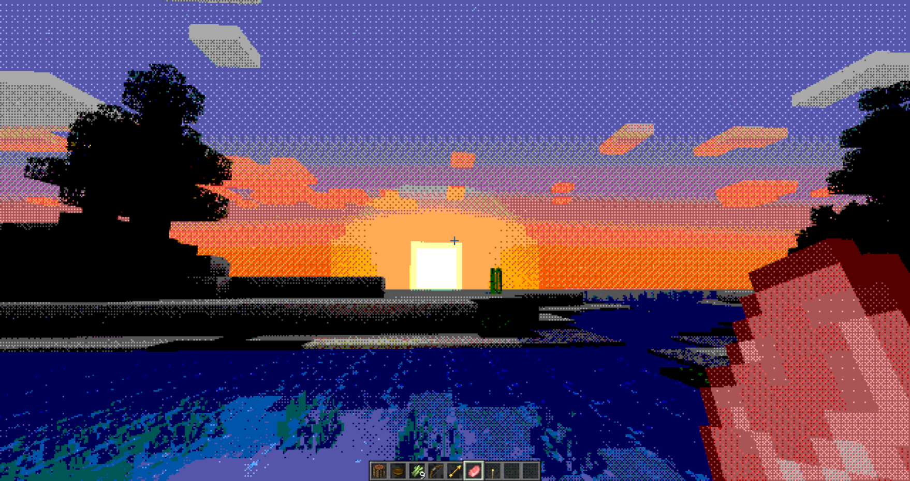
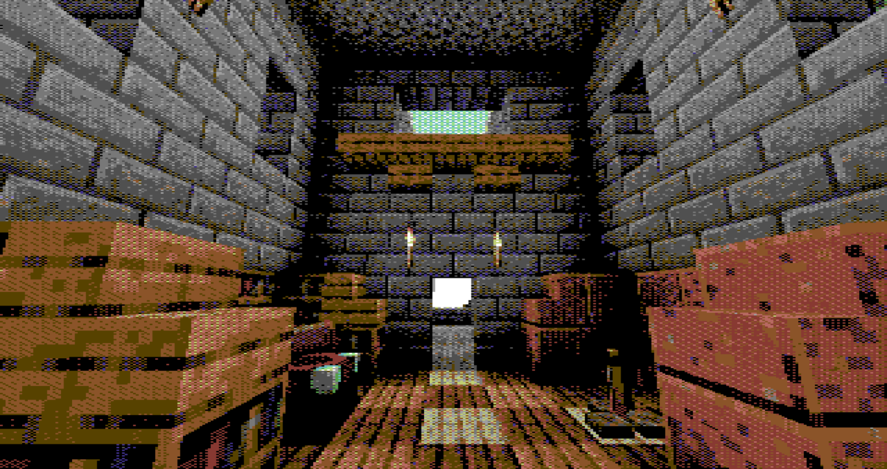
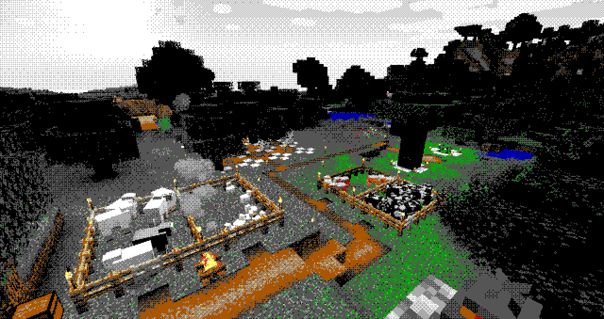
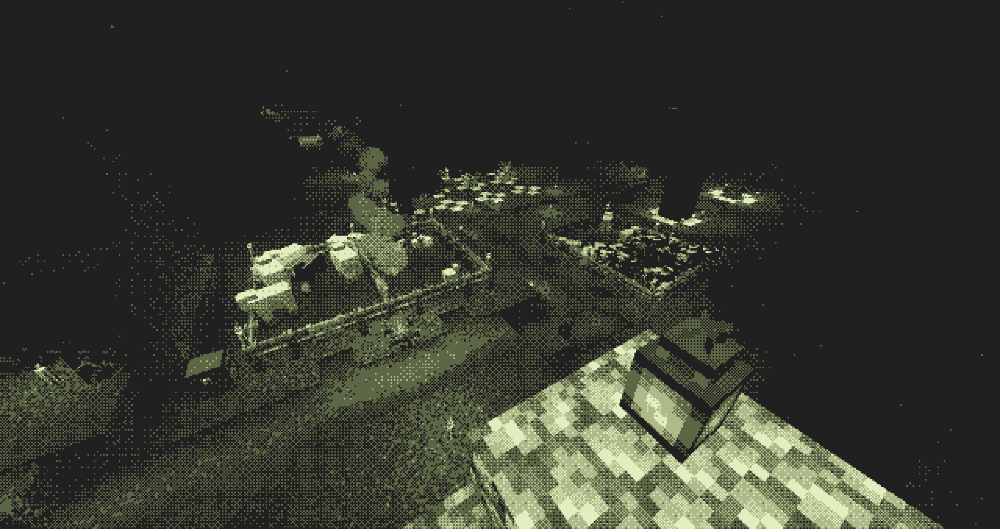

# maple's retro extravaganza

it's a minecraft shader pack with some palettes to emulate retro console graphics. isn't it great?

included palettes:
1. Sage Minor System (_Sega Master System_)
2. For Workgroups (_16-color CGA/EGA_)
3. Minecraft16 (_Minecraft dye colors_)
4. Captain 64 (_Commodore 64_)
5. Gremlin Boy (_Game Boy_)
6. Virtual Girl (_Virtual Boy_)
8. 8088 Mode 0 (_4-color CGA, red yellow and green_)
7. 8088 Mode 1 (_4-color CGA, cyan pink and white_)
8. Sir Clive's Special (_ZX Spectrum_)
9. Hypercard Dreams (_Macintosh_)
10. Mode 13h (_256 color VGA_)
11. SimpleJPC-16 (_by [@adigunpolack](https://twitter.com/adigunpolack)_)
12. Human Entertainment System (_NES_)

## screenshots

_Sage Minor System_

_Captain 64 palette with 6x3 pixels_

_For Workgroups (day)_

_Gremlin Boy (night)_

## usage

get optifine installed in your java minecraft version of choice and download this repository as a zip into your shaderpacks folder

you can also unpack it into its own folder inside shaderpacks

## modding

if you're feeling adventurous, making a color look-up image for a custom palette is simple, just take the identity LUT in `shaders/tools/clut_identity.png` and modify it to fit your palette. there are also some additional palettes not enabled in the shader that you can play around with. look at `shaders/shaders.properties` to find where to change the path for LUT textures.